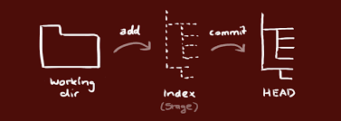

### GitHub Tutorial

*Git* is an open source program for tracking changes in text files. It is the core technology that *GitHub*, the social and user interface, is built on top of.

#### Installation:
* Sign up for Github: [https://github.com]
* Install GitHub Desktop: [https://desktop.github.com/]

#### Initialization:
A *repository* is the most basic element of GitHub. They're easiest to imagine as a project's folder and they can have multiple collaborators.
* Create a new empty repository
	* create through GitHub website
	* create through GitHub desktop
* Create a repository from existing local folder
	* create through GitHub desktop
	
A *clone* is a copy of a repository that lives on your computer instead of on a website's server.	A *fork* is a personal copy of another user's repository that lives on your account. Forks allow you to freely make changes to a project without affecting the original.
* Fork and Clone an existing git repository
	* create through GitHub desktop
	
#### Some terminology:
Adapted from [https://help.github.com/articles/github-glossary/](https://help.github.com/articles/github-glossary/)

* Branch: A *branch* is a parallel version of a repository.  It is contained within the original repository, but does not affect the master branch allowing you to work without disrupting the "live" version. When you're done editing, you can merge your branch back into the master branch to publish your changes.
* Commit: A *commit*, or "revision", is an individual change to a file. It's like when you save a file, except with Git, the save also creates a unique ID that allows you to keep record of what changes were made when and by who.
* Markdown: *Markdown* is a simple semantic file format, not too dissimilar from .doc, .rtf and .txt. Markdown makes it easy for even those without a web-publishing background to write prose and have it displayed like a website.
* Merge: *Merging* takes the changes from one branch (in the same repository or from a fork), and applies them into another.
* Pull: *Pull* refers to when you are fetching in changes and merging them. For instance, if someone has edited the remote file you're both working on, you'll want to pull in those changes to your local copy so that it's up to date.
* Push: *Pushing* refers to sending your committed changes to a repository hosted on GitHub. For instance, if you change something locally, you'd want to then push those changes so that others may access them.
	
	
#### Work on GitHub Desktop
* Work in local repository
    * Add/Change files
    * Commit to local repository
	* Push to remote repository
	* Pull to local repository
* Work with collaboration
	* Fork and clone a (master) repository
	* Create a branch
		* Branching is the way to work on different parts of a repository at one time. It creates a snapshot of the original branch.
    * Make a commit
	* Open a pull request 
	* Merge pull request into the master branch
	* Pull to local repository

#### Workflow

*source:http://rogerdudler.github.io/git-guide/ *

#### Reference
* Tutorial for GitHub website: [https://guides.github.com/activities/hello-world/](https://guides.github.com/activities/hello-world/)
* Tutorial for GitHub desktop:
[https://help.github.com/desktop/guides/getting-started/](https://help.github.com/desktop/guides/getting-started/)
